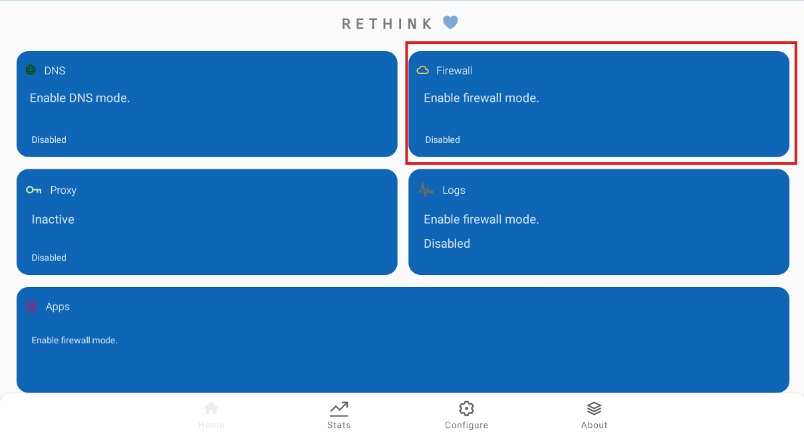
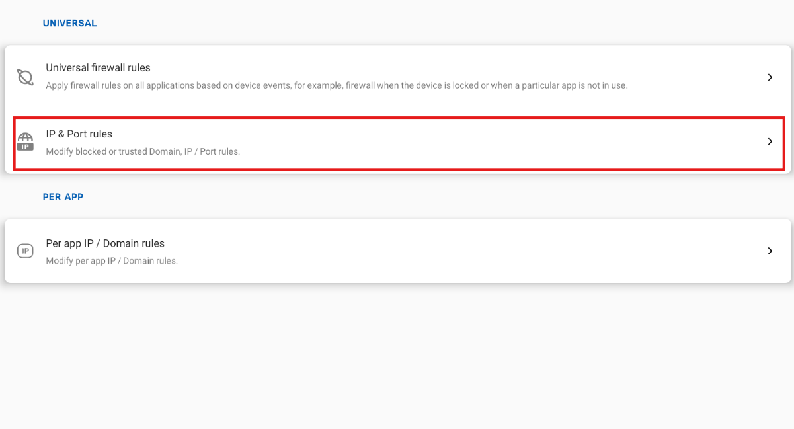
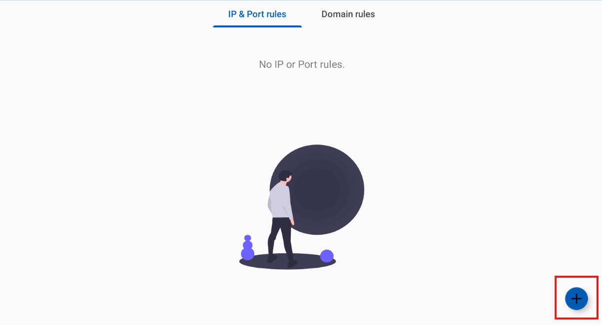
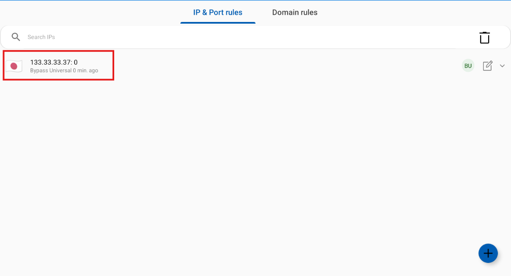
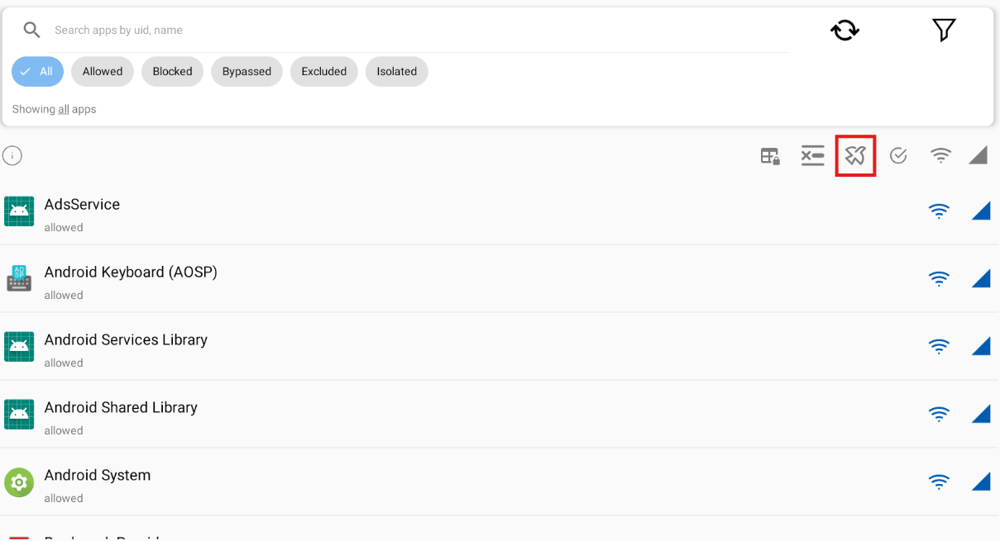

# SocksTun setup

## Step 1 - Download Rethink

* Rethink APK - https://github.com/celzero/Rethink-app/releases/tag/v0.5.5n

## Step 2 - Install & open Rethink

This step as is as simple as dragging and dropping the APK you have downloaded previously onto the instance you want to proxy. If this is not an option, or doesn't work, there is an `APK` button on the right bar of your bluestacks/ld player instance.
Once installation is complete, you should see this icon:

Tap on that icon to make the app open. When opening Rethink for the first time a tutorial will be presented. You can skip this by pressing skip.

## Step 3 - Adding a proxy

Tap on the `Proxy` button.

Tap on the `Setup SOCKS5 Proxy` option.

Fill in your proxy credentials as shown `1`. Leave both _Block UDP except DNS and NTP_ and _Loopback proxy forwarder apps_ unchecked as shown `2`. Tap `Set` as shown `3`.

When done correctly you should return to the setup page, which now looks like this. Notice that the slider is now blue/checked.

Tap the back button which brings you to the main screen. Tap the `Start` button to activate your proxy. When you tap this button some pop-ups may appear. In order for the app to work properly, follow the instructions given by Rethink and allow connections and/or disable battery optimization.

Nice! You have now set up Rethink to proxy all the traffic in this device/emulator through your proxy.

## Step 4 - Whitelisting IPs (optional)
To save proxy data usage and use a more stable connection to Pow, it is recommended to whitelist certain IP(s) to improve the connection.

Tap on the 'Firewall' button.

Tap on the `IP & Port rules` button.

Tap on the `+` button.

Fill in the IP you want to whitelist as shown `1`. Tap on `Bypass universal` as shown `2`. Then tap `Okay` to save as shown `3`.

When done correctly, the IP will be added to the list.

## Step 5 - App configuration (optional)
If you want to only want certain apps like OSRS to be tunneled through your proxy you can use apps to configure so.

Tap on the `apps` button.

Tap on the plane like button and tap `Apply`. This will make it so all apps are excluded from the proxy tunnel.

To include OSRS/Chrome into the tunnel, search for it by typing the name in the top bar. When found, tap on the app to open details.

Tap on the `Bypass universal` button to change it to allow traffic from this application to go through your proxy.

You need to do this for every app you want to go through the proxy. In this example OSRS will be the only app that is allowed to redirect traffic through your proxy.

## Step HELP - I'm still having issues

There could be a couple of reasons why you may be having issues. These are listed below:
* Cannot connect to game - This is caused by your proxy not working correctly. Please confirm it is a working proxy and try again. Reconnecting sometimes does help. Replace your proxy if your provider allows you to.
* Powbot bar does not appear - This is caused because you logged into powbot before setting up the proxy. Simply remove the game from your instance, and re-install using the latest installer (this can be found on our discord under #downloads). Make sure your proxy is on before logging into powbot/the game.
* I am lost - Please join our discord and describe your issue in as much detail as you can. This will help us with helping you to troubleshoot your issue.
