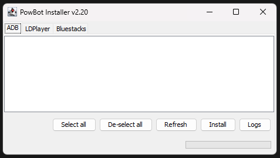
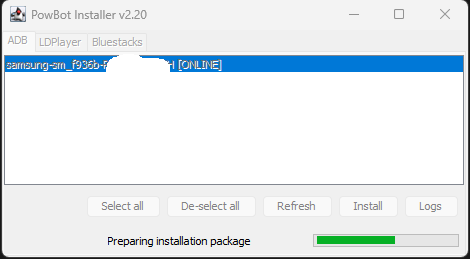
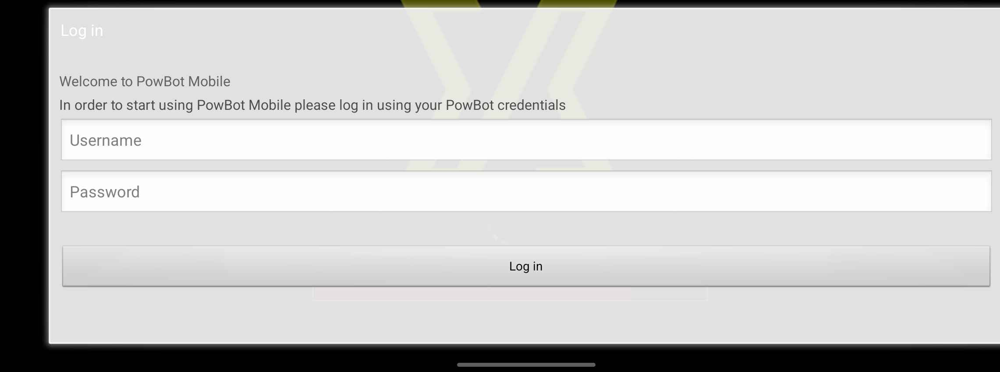

# Installing PowBot on a physical device

Please ensure you have met the requirements in the [requirements](../install/index.md) page before following the steps below.

This guide will cover enabling Developer tools, enabling USB Debugging and installing PowBot on a physical Android device.

## Step 1 - Download and run the PowBot Installer

The link to download the PowBot Installer can be found in our discord server, in the ['Downloads and setup'](https://discordapp.com/channels/341014842745815054/976860980187390072) channel.

Once downloaded, run the installer by double clicking it. Accept any terms and conditions that may appear.

* Please note that the installer might take a while to load on slower machines/connections, please be patient.

Once the installer has loaded, select the `ADB` tab. You should see the following screen at this point:

{: style="height:250px"}

## Step 2 - Enable USB Debugging

On your device, go to `Settings` -> `About phone` -> `Software information` and find the `Build number` field. Tap on it 7 times to enable 'Developer options'. 

(If you do not see these options, it would be best to search online for your device's specific instructions.)

You should see a popup saying `You are now a developer!`.

{: style="width:250px"}

Once done, go back to the `Settings` menu and find the `Developer options` menu. Tap on it to open it. Then find the `USB debugging` option and enable it.

{: style="height:250px"}

## Step 3 - Connect your device and allow USB debugging

Connect your device to your PC using a USB cable. You should see a popup on your device asking you to allow USB debugging. Tap on `Allow`.

{: style="height:250px"}

## Step 4 - Install PowBot

Go back to the installer and under the `ADB` tab, click the 'Refresh' button. You should see your device appear in the list with an `[ONLINE]` tag next to it.

{: style="height:250px"}

Select it and click on the `Install` button. When prompted for what version to install. You're free to pick either.

* Release: The latest stable version of PowBot. This is usually the most stable version of the client to use.
* Beta: The latest beta version of PowBot. This may have new features that are not yet available in the release version, but may also have bugs.

{: style="height:250px"}

Now sit back and wait for the installation to complete. Once done, you will see the game open up on your device followed shortly by the PowBot Login screen.

{: style="height:250px"}

## Troubleshooting

* If you are having trouble getting the installer to detect your device, please ensure that you have enabled USB debugging and that your device is connected to your PC via a working USB cable.

* If you are still having trouble, please join our [Discord server](https://discord.gg/Y8TGmMh47r) and ask for help in the [`#help`](https://discordapp.com/channels/341014842745815054/1037874582222274612) channel.
