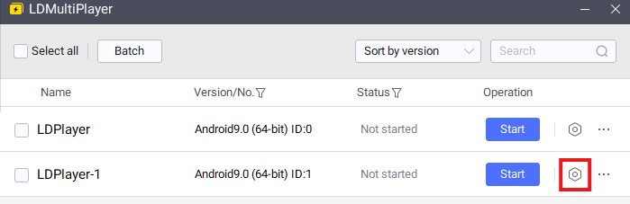

# Installing PowBot on a LD Player instance

Please ensure you have met the requirements in the [requirements](../install/index.md) page before following the steps below.

This guide will cover installing LD Player, creating a new instance and installing PowBot on it.

## Step 1 - Download and run the PowBot Installer

The link to download the PowBot Installer can be found in our discord server, in the ['Downloads and setup'](https://discordapp.com/channels/341014842745815054/976860980187390072) channel.

Once downloaded, run the installer by double clicking it. Accept any terms and conditions that may appear.

* Please note that the installer might take a while to load on slower machines/connections, please be patient.

Once the installer has loaded, you will see the following screen:

{: style="height:250px"}

## Step 2 - Download and install LD Player

Download and install LD Player 9 from the [official website](https://www.ldplayer.net/).

* Please ensure you download LD Player 9 and not any other version.
* Make sure to restart your PC after installing.

## Step 3 - Create a new instance

LD Player allows you to create multiple instances on the same machine. This is useful if you want to have multiple clients open at the same time.

Start by opening the LD Player Multi-instance Manager and click on the `Add Instance` button in the bottom right of the window, followed by `New Instance`.

{: style="height:450px"}

Select `Android 9.0 (64-bit)` as the Android version.

{: style="height:450px"}

Now go into the newly created instance settings

{: style="width:600px"}

On the `Advanced` tab, ensure the following settings are selected:

- Resolution: Recommended is `960x540`
- CPU: Recommended is `2 cores`
- RAM: Recommended is `2GB` / `2048mb`
- Shared Disk: `System.vmdk writable`

{: style="height:450px"}

On the `Other settings` tab, ensure the following settings are selected:

- Enable ADB: `Enabled`

{: style="height:450px"}

## Step 4 - Start instance and install PowBot

Start the instance by clicking on the `Start` button. Wait until the instance has fully booted up.

{: style="height:450px"}

Go back to the installer and under the `ADB` tab, click the `Refresh` button. You should see your instance appear in the list with an `[ONLINE]` tag next to it.

{: style="height:250px"}

Select it and click on the `Install` button. When prompted for what version to install. You're free to pick either.

* Release: The latest stable version of PowBot. This is usually the most stable version of the client to use.
* Beta: The latest beta version of PowBot. This may have new features that are not yet available in the release version, but may also have bugs.

Now sit back and wait for the installation to complete. Once done, you will see the game open up on your instance followed shortly by the PowBot Login screen.

{: style="height:450px"}

